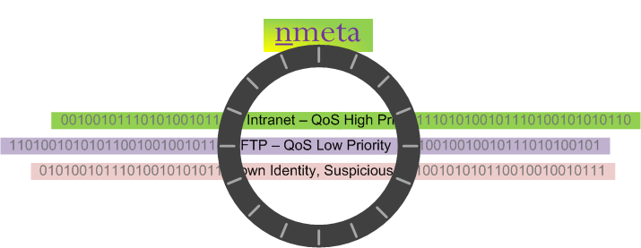

# nmeta - Network Metadata

This project is founded on the belief that innovation in enterprise networks requires a foundation layer of knowledge about both the participants and their types of conversation. The production of this network metadata requires policy-based control and ability to adapt to new purposes through extensibility. 

Nmeta is a research platform for traffic classification on Software Defined Networking (SDN).  It runs on top of the Ryu SDN controller (see: http://osrg.github.io/ryu/) 

# Design Philosophy

The collection and enrichment of flow metadata should be decoupled from
systems that consume it. This abstraction is intended to encourage the
development of innovative new uses for flow metadata.

Policy is used to control how traffic classifiers of many types
(i.e. this is a multiclassifier system) are employed and what actions
they can take.

Flow metadata can be enriched by the policy-controlled classifiers - i.e.
extra data can be added.

Example uses for this enriched flow metadata include Quality of Service
(QoS), security and traffic engineering.

It is designed to work in an online mode such that classifications are
made in a timely manner so that consuming systems may take actions while
the flow is still newly active.

# Installation

Note: see wiki page for full instructions for [Installing on Ubuntu](https://github.com/mattjhayes/nmeta/wiki/Installing-on-Ubuntu)

1) Prerequisites:
As a prerequisite, install Git, Python, python-yaml and Ryu on a Linux system.

2) Install nmeta:
From the home directory on server that has Ryu installed:

```
mkdir nmeta
git clone https://github.com/mattjhayes/nmeta.git
```

3) Fix LLDP bug (optional)
The lldp.py packet library module supplied with Ryu has 
(at the time of writing) a bug related to parsing system
capabilities. A modified version of this file can be 
copied over the original to fix this.

First back up the original lldp.py file:

```
cp ryu/ryu/lib/packet/lldp.py ryu/ryu/lib/packet/lldp.py.original
```

Now overwrite lldp.py with the modified file:

```
cp nmeta/lldp-fixed.py ryu/ryu/lib/packet/lldp.py
```
    
4) Run nmeta:
Navigate to the Ryu root directory:

```
cd
cd ryu
```

Run nmeta:

```
PYTHONPATH=. ./bin/ryu-manager ../nmeta/nmeta.py
```

# Configuration

Configuration files are in the config subdirectory and are written
in YAML ("YAML Ain't Markup Language") format
(see: http://www.yaml.org/spec/1.2/spec.html)

## General Configuration

The general configuration parameters are stored in the file:

```
config/config.yaml
```

## Traffic Classification Configuration

Traffic Classification (TC) configuration parameters are stored in the file:

```
config/tc_policy.yaml
```

### Static Classifiers

TBD
  
### Identity Classifiers

  All identity classifiers are prefixed with 'identity_'
  LLDP systemname may be matched as a regular expression
  The match pattern must be contained in single quotes
    Example:
    -------
    To match system names of *.audit.example.com add this policy condition:
    
```
identity_lldp_systemname_re: '.*\.audit\.example\.com'
```

### Statistical Classifiers

  All statistical classifiers are prefixed with 'statistical_'

TBD - more here
  
### Payload Classifiers

TBD

## QoS Configuration

Quality of Service (QoS) configuration parameters are stored in the file:

```
qos_policy.yaml
```

# Logging

TBD

# API

REST API Calls (examples to run on local host):

Return the Flow Metadata Table:
curl -X GET http://127.0.0.1:8080/nmeta/flowtable/

Return the Identity NIC Table:
curl -X GET http://127.0.0.1:8080/nmeta/identity/nictable/

Return the Identity System Table:
curl -X GET http://127.0.0.1:8080/nmeta/identity/systemtable/

# Misc Scripts

A few scripts that may be useful for testing are included
in the misc sub directory

# Caveats

 - Some tables (FCIP) will grow and grow until the system falls over as there 
   is no reaping of stale entries (BAD BAD BAD!!!). Maintenance for other
   dynamic tables implemented as max age controls but need max size controls
   too...
 - Only supports OpenFlow version 1.0
 - YAML creates an unordered dictionary, but we want strict order for 
   policy... Seems to work regardless but results may vary
 - Written and tested on Python version 2.7.5. May not work as expected
   on Python 3.x

# Feature Enhancement Wishlist

## Functional Enhancements
 - Improve TC policy functionality by adding nesting ability etc.
 - Add support in static module for IP address range and netmask matches
 - Add support for IPv6
 - Add support for IP multicast
 - Add support for IP fragments
 - Add support in identity module for IEEE 802.1x
 - Add support for VLANs and other similar network virtualisation features
 - Make the routing/switching configurable (currently just a basic switch). 
   Leverage other systems that do this rather than writing something new.

## Non-Functional Enhancements

### Availability
 - Improve measures to prevent table sizes from getting too large and impacting availability
 - Consider event driven tidy-up too, i.e. port goes down, purge any port
   related data from tables
 - 
### Security
Add security features. Really this should be top of the list.
 - How can DoS of the system be prevented or mitigated?
 - Data packets are sent over the control plane so it is vulnerable to exploits in packet data. How can this be mitigated?

### Scalability
 - Add support for distribution of controllers such that flow metadata 
   maintains loose consistency across the distributed system

### Performance
 - Consider moving tables to a database

### Visibility
 - Improve API functionality

### Compatibility
 - Add support for OpenFlow versions 1.2 and 1.3
 - Consider decoupling from Ryu and building in support for other SDN controllers

### Convenience
 - Make classifiers plug-ins so that they can be developed and added/removed
   without requiring changes to the main code.
 
# Release Notes

TBD

# Disclaimer

This code carries no warrantee whatsoever. Use at your own risk.

# Contact

Matt Hayes (matthew_john_hayes@hotmail.com)

