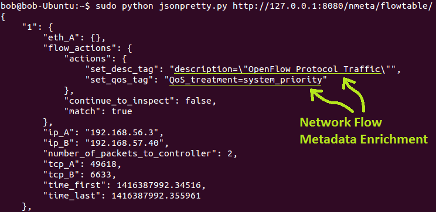

# nmeta - Network Metadata

The nmeta project is founded on the belief that innovation in enterprise networks requires a foundation layer of knowledge about both the participants and their types of conversation. The production of this enriched network metadata requires policy-based control and ability to adapt to new purposes through extensibility. 

Enriched network metadata has a number of uses, including classifying flows for Quality of Service (QoS), traffic engineering and security.

Nmeta is a research platform for traffic classification on Software Defined Networking (SDN).  It runs on top of the Ryu SDN controller (see: http://osrg.github.io/ryu/). One day it may even be good enough to run in a real enterprise network...

# Design Philosophy

The collection and enrichment of flow metadata should be decoupled from
systems that consume it. This abstraction is intended to encourage the
development of innovative new uses for flow metadata.

Policy is used to control how traffic classifiers of many types
(i.e. this is a multiclassifier system) are employed and what actions
they can take.

Flow metadata can be enriched by the policy-controlled classifiers - i.e.
extra data can be added.

The system is designed to work in an online mode such that classifications are
made in a timely manner so that consuming systems may take actions while
the flow is still newly active.

# Documentation
For documentation see the website (https://mattjhayes.github.io/nmeta/)

